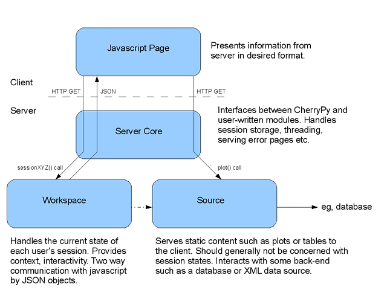

Extending Overview
==================

Overview is a framework for writing interactive monitoring tools for CMS. The
backend modules are programmed in python, using cherrypy webserver and the
frontend in javascript, using the `YUI <http://developer.yahoo.com/yui>`_
widget library.

This is a guide to writing a custom Overview module. A working knowledge of
python and CMS computing concepts will be assumed.

Getting started with the server
-------------------------------

First `install the development environment <overview-devguide>`_. To write a
minimal Overview extension plugin you will be working with the code in the
``src/python/Overview`` and ``src/javascript/Overview`` directories. The code
outside them is of little interest.

Start the server and check out the sources as shown in the development guide.
Look at ``/data/current/config/overview/server-conf.py`` to get familiar with
the server configuration file.

Design summary
--------------

Overview is highly modular. Your extension will normally comprise of at least
one python workspace and view, their associated javascript plugins, and a data
source. The following diagram illustrates the relation of these parts.

Core
~~~~

`The core server <_modules/Monitoring/Core/GUI.html#Server>`_ loads sources
and workspaces defined in the config file, and handles all requests from the
web, passing them onto the relevant user-defined components. The exact details
of this component are unimportant to a plugin implementor.

The most important function of the core from the plugin writer's point of view
is the session dictionary. Each session -- started when a user browses to an
``overview/`` page without an appended session name -- is a python dictionary,
which is stored by the server as a pickled [#fpickle]_ file when the session
is idle. This allows users persistence between browser sessions, if they
return to the same URL.

Keys in the session dictionary are of the form ``workspace.view.key``, mainly
to avoid collisions between keys set by different workspaces and views.

.. rubric:: Footnotes
.. [#fpickle] Python serialisation format.

Workspaces
~~~~~~~~~~

Overview interaction with users is designed around *workspaces* and *views.*
The scope of a workspace is a particular monitoring task, either a subject
such as CAF or PhEDEx, or an operator function such as "check data transfers."
A view is a subsystem or interactive data displays and plots within that task.

Workspaces and views both server side python objects, and views browser side
javascript objects. The python objects manage the state of the user's session
and send state updates in JSON to the javascript object, which renders the
user interface, reacts to state updates by updating the HTML page view, and
translates user interactions into REST calls. The back-and-forth exchange uses
AJAX calls. As a general design point the workspace server side object should
not do any data processing, but just deal with the session state as required
for interactivity and context sensitivity; actual data should be provided by
*sources* which are `described below <#source>`_.

Possible functions of the workspace module might be:
 * Appropriately filling list boxes with context-relevant options
 * Handling text auto-completion
 * Maintaining a go-back list of recent actions

Some of these functions could arguably be done entirely client-side in
javascript, but the advantage provided by having as many operations as
possible interacting with the server is that the session states are
persistently stored by the server and so a user can go back to the exact
previous state of a session using the appropriate URL. It also greatly
simplifies the view programming, avoiding many easily made mistakes were
one to use pure asynchronous server calls.

Server workspaces inherit from :obj:`.CompWorkspace` which provides much of
the default behaviour. At the minimum the workspace plugin must be able to
initialise itself and provide a response to session state query, in the form
of ``__init__`` and ``_state`` methods:

.. function:: __init__(self, gui, rank, category, name, \*args)

   Create the workspace object. Pass to the base class :obj:`.CompWorkspace`
   constructor the *gui*, *rank* and *category* arguments, followed by a *tag*
   for building state dictionary keys for this workspace, then *name*, and
   finally a list of view objects for this workspace. Install the javascript
   and css content by calling *gui's* :obj:`~Server._addJSFragment()` and
   :obj:`~Server._addCSSFragment()` methods. The entire user interface is
   built dynamically in javascript so neither workspaces nor views can have
   HTML or other page templating content.

   :arg Server gui: reference to the server object.
   :arg int rank: display order of the workspace.
   :arg str category: title for workspace category in top menu.
   :arg str name: title to show for this workspace in top menu.
   :arg list args: any other arguments provided in the config file.

.. function:: _state(self, session)

   Invoked whenever it's necessary to generate JSON for the user session.
   Usually simply forward the call to the base class :obj:`._dostate()` method
   which builds the full JSON response. If the session's current view has a
   ``state()`` method, :obj:`._dostate()` will automatically invoke it and
   merge the fragment into the final response.

   :arg session: session dictionary; pass to :obj:`._dostate()`.
   :return: user JSON session state.
   :rtype: string

REST GET calls from browser go to the workspace -- not the view. For example
``/overview/session/sessionid/method?name1=value1;name2=value2`` becomes a
call to:

.. function:: sessionMethod(self, session, \*args, \*\*kwargs)

   Implement ``method`` REST API call.

   :arg session: session dictionary.
   :arg args: URL path arguments, at least [sessionid, method] but can be more.
   :arg kwargs: dictionary of URL named arguments.
   :return: user JSON session state for calls made with ``makeCall()``.
   :rtype: string

Views
~~~~~

Each workspace has one or more views. In javascript views are objects attached
under ``GUI.Plugin``. In python views are nested classes in the workspace,
with at least ``plugin`` and ``name`` properties. The ``plugin`` names the
class under ``GUI.Plugin`` to handle JSON state updates for the view.  The
``name`` property provides the view's user-visible name in the top menu. If
the view has non-trivial state, it should also provide a ``state()`` method:

.. function:: state(self, session)

   Returns a JSON string fragment representing the view state, formatted as::

    { "kind": "NAME", "abc": "value", "xyz": 123 }

This fragment will invoke *update()* method on ``NAME`` javascript module,
with the above dictionary as an argument. For the sanity of anyone else
having to maintain the code, ``NAME`` should be some concatenation of the
workspace and view names, and should be equal to the ``plugin`` property.

The full JSON state update generated by :obj:`._dostate` will include other
elements such as ``OverviewHeader`` which provides the top banner menu with
the list of workspaces and views, and ``AutoUpdate`` which instructs the
browser to retrieve a state refresh periodically. The in-browser code invokes
*update()* method for each response element. A complete JSON response might
look like this::

    ([{ "kind": "AutoUpdate", "interval": 300, "stamp": 1224502159 },
      { "kind": "OverviewHeader", "workspace": "MYWORKSPACE",
        "workspaces": [{ "title": "MYWORKSPACE", "label": "myworkspace" },
                       { "title": "OTHER", "label": "other" }],
        "views": [{ "title": "MYVIEW1", "label": "myview1" },
                  { "title": "MYVIEW2", "label": "myview2" }]},
      { "kind": "MyViewPlugin", "mydata": myvalue }])

This will invoke ``GUI.Plugin.MyViewPlugin.update({"mydata": myvalue})``.
Obviously the javascript code for this plugin will need to be loaded into the
HTML page somewhere, usually in the workspace constructor as explained above.
We'll describe the exact interactions between python and javascript `in more
detail later <#plugin>`_.

As a general point of design, typically the javascript side has most of the
view functionality and code, with the server side mostly just validating and
maintaining the session state. Usually the server side is used to heavy
lifting not reasonably possible to execute on the browser side.

Source
~~~~~~

A source is a server extension that produces actual content, such as images
and tables for display in browser. Typically a source is a gateway to some
upstream image, XML or database source, and converts data from that source
into graphs which are served on demand to Overview clients. Normally data from
the source should be either JSON, plain text or images. Generating HTML from
the source is almost always a bad idea.

Although technically possible, a source should not consider the session state
and should serve data in a static way, defined only by the arguments in the
URL. This allows the source to be used as a bona-fide REST data source, and
avoids building representation into the server. The view javascript plugins
should do all user interface rendering using the raw data from the source.

There is no base class for sources. You can either have none, or use any other
convenient class. One particularly common use is :obj:`Thread` for building
sources which run asynchronously to collect data from elsewhere, for example
to run an image scraper.

The source must provide property ``plothook`` which defines where the source
will be mounted in the URL name space. Given ``plothook = 'xyzzy'``, the
mount point will be ``/overview/plotfairy/xyzzy``. In addition the source
must provide at minimum the following functions:

.. function:: __init__(self, gui, path, \*args)

   Source constructor.

   :arg gui: reference to the server object.
   :arg path: full path to a directory the source can use for storage; it is not guaranteed to exist yet.
   :arg args: any other arguments from the config file.

.. function:: plot(self, \*args, \*\*kwargs)

   Main work method for generating output, usually plots of some form.
   Called whenever a plot URL includes the ``plothook`` of this source.

   :arg args: remaining URL path components.
   :arg kwargs: dictionary of URL key/value arguments.
   :return: tuple of (mimetype, data), possibly (None, None)

The source may also provide the following method:

.. function:: prepareSession(self, session)

   Called whenever the server creates a new session. In most cases not
   needed, but allows source to customise the session object.

   :arg session: session dictionary.

Clearly the most important from your point of view is the ``plot()`` method,
which is where you serve the images or text requested by the browser. Given
``plothook = 'xyzzy'`` the source will be mounted to serve requests at URL
``/overview/plotfairy/xyzzy/path?args``. The path part can be an arbitrary
number of directories: ``/overview/plotfairy/xyzzy/path/to/plot?arg=val``
yields call to ``plot(['path', 'to', 'plot'], { 'arg': 'val' })``.

The ``plot()`` function should return a tuple (mimetype, data) such as
``('text/plain', 'hello')`` or ``('image/jpg', open('img.jpg').read())``.
Returning ``(None, None)`` or just ``None`` causes the server to return HTTP
500 error to indicate the request failed; do not elaborate on that, except to
print a message to the server log to explain why that happened.

To create pictures the preferred solution is to return raw JSON from the
server and render it in the browser using `protovis <http://protovis.org>`_ or
`d3.js <http://mbostock.github.com/d3>`_. Much of existing Overview renders
plots on the server side using :obj:`~GuiPlot` utilities and more generally
`PIL <http://www.pythonware.com/products/pil/>`_ and `matplotlib
<http://matplotlib.sourceforge.net/>`_. These do produce high quality plots in
PNG, PDF and SVG, but these days it's better to push the rendering into the
browser where possible.

If your source needs to perform caching, either use :obj:`GuiCache` or roll a
custom cache into your source. It's very reasonable to cache data, especially
data likely to be accessed frequently across many user sessions. That said, be
careful what and how much you cache, the server should be able to live within
reasonably modest memory budget.

Plugin
~~~~~~

The plugin is a javascript object loaded into the HTML page when the user
first visits the Overview page. The plugin encapsulates all the functionality
required to interact with the relevant sources and the workspace view. The
workspace constructor pulls in the javascript modules needed by all the views
of that workspace. The basic server core handles its own javascript, and adds
some basic YUI components.

The plugins are written using prototype-like javascript objects. The object
has a number of inner variables (closure variables), inner functions, and
publicly visible functions. You can think of it approximately as a class, but
it not exactly the same thing. Usual javascript schemes are available to
implement a form of inheritance and base function sharing; just remember the
code is based on prototypes, meaning object, not class, inheritance. The
complete details of the javascript programming style are beyond the scope of
this document; most developers can get along using existing code as examples.

The javascript side of the framework makes use of the YUI library. Knowledge
of this would be helpful to make a properly interactive interface.

A bare bones javascript plugin looks something like this::

  GUI.Plugin.MyViewPlugin = new function()
  {
    var _gui = null;
    var _self = this;
    var _canvas = $('canvas');

    this.attach = function(gui)
    {
      _gui = gui;
    };

    this.detach = function()
    {
      while (_canvas.firstChild)
        _canvas.removeChild(_canvas.firstChild);

      _gui = null;
    };

    this.update = function(data)
    {
      var content = data.message;
      if (_canvas.innerHTML != content)
        _canvas.innerHTML = content;
    };

    return this;
  }();

The name of the plugin, ``MyViewPlugin`` here, is the name given in the state
JSON fragment ``{ "kind": "MyViewPlugin", ...}``. That data object is passed
to the ``update()`` method, which should update the HTML ``canvas`` element to
view contents. HTML page elements can be retrieved using ``$('name')``,
roughly equivalent to ``getElementById('name')``. In general the code should
make incremental DOM updates to avoid undesirable user interface flicker, but
simple small content updates can be made as shown above, checking existing
content against desired content.

The ``attach()`` method is called when the plugin becomes the current view
manager. It should save the reference to the *gui* object, which is needed to
do things like make REST calls to the server. If the view has a non-trivial
user interface, build it in ``attach()`` and save references to key HTML
elements in closure variables after you've created the page contents.

The ``detach()`` method is invoked when the plugin is detached, for example
when the user changes workspaces or views. The method should undo whatever
changes ``attach()`` and ``update()`` methods have made, leaving the HTML to
its original state. It should also cancel any timeouts or intervals the view
has installed, or any mouse action handlers. In short, it should revert any
global state changes. Also make sure to reset closure variables to avoid
retaining lingering references to objects which should be garbage collected.

Note that the ``update()`` method can be called at any time, and will often
be called as a response to server REST calls -- many of which return a new
state in response to the action. The plugin code should be prepared to handle
an ``update()`` call at any time. The data coming from the server is always
authoritative; the state in the browser should be discarded whenever the two
differ.

The plugin can have private variables as shown above. In general they should
be closure variables, inaccessible from outside the plugin. The ``_self`` is
often necessary because in javascript ``this`` may refer to something other
than your plugin object, for example user interface ``onclick`` handlers will
often have the form element as ``this``.

To interact with the server, create a function to handle some event such as
``onclick`` or ``onchange``, or an interval timer. To place a call do:
``_gui.makeCall(_url() + "method?arg=" + encodeURIComponent(value));``
where *_gui* is the closure variable captured from ``attach()`` as shown
above. This will arrive in the server as a call into current workspace's
``sessionMethod(['sessionid', 'method'], { 'arg': 'value' })``. The latter
should reply by sending a new session state by calling :obj:`._state()`.

Note that ``makeCall()`` calls are automatically serialised and the replies
are guaranteed to be processed in the order the browser made the calls. Do be
careful nevertheless not to confuse yourself if it's possible for user to
initiate several overlapping actions, for example by rapidly clicking on user
interface elements, or you implement features such as auto-completion. If you
use YUI's ``YAHOO.util.Connect.asyncRequest()`` or the underlying AJAX HTTP
requests, beware they are *not* guaranteed to execute in order, and several
may be executed concurrently. In fact it's not even guaranteed that AJAX calls
arrive on the server in the order they are started in the browser. If you use
``makeCall()`` you get much better order guarantees, but still may need to
care not to undo effects of several actions occurring in rapid-fire sequence.

If you need to refer to the server, for example to load raw text content
straight from the server, use global variables such as ``ROOTPATH`` and
``FULLROOTPATH`` to construct your URLs.

Configuration
~~~~~~~~~~~~~

The server is configured in python, using an instance of :obj:`.ServerDef`. As
it's python, you can do almost anything, but it tends to be wise to resist the
temptation to do anything clever. You'll normally find the following constructs
in the configuration.

``modules = ('Module1','Module2')``
  List of python modules to load into the server; at least the modules providing
  the workspaces and sources need to be named here.

``envsetup = 'STRING'``
  Commands (typically ``source .../xyz.sh``) to be exec'd at server startup.

``server.port = 9000``
  Port used by the server.

``server.serverDir = '/PATH'``
  Root path of the server's storage directory. Should contain at least a
  folder ``www/sessions`` where pickled sessions will be stored. Directories
  for source data storage will also be allocated under this path.

``server.baseUrl = '/PATH'``
  Start of all URLs for this system. '/overview' has been assumed for all the
  content above. Going to the web-server root will get you nothing.

``server.title = 'NAME'``
  Displayed at top left of page.

``server.serviceName = 'NAME'``
  Not used for anything in Overview (used in DQM GUI).

``server.service('NAME', 'URL')``
  Add a service and its address to the service ring. These are not shown in
  the Overview user interface; in DQM GUI they are shown as a ring of
  associated services, allowing users to switch between related services.

``server.source('NAME', ARG..)``
  Install an instance of ``NAMESource`` into the server, with whatever
  arguments follow.

``server.workspace('NAME', RANK, 'CATEGORY', 'TITLE', ARG...)``
  Install an instance of ``NAMEWorkspace`` into the server with the arguments
  ``(RANK, CATEGORY, TITLE, *args)``. The same workspace type can be
  instantiated several times with different arguments; the ``TITLE`` parameter
  allows them to be labelled uniquely. Workspaces are displayed in the user
  interface in increasing order by ``RANK``, not in order of appearance in the
  configuration.

``server.extend('NAME', ARG...)``
  Instantiate ``NAME`` extension with the remaining arguments. An extension
  is an object which is neither workspace nor a source, but is needed to be
  present nevertheless. It may be an object such as an asynchronous cache,
  or a CherryPy content provider which does not match anything else. The
  latter objects need to mount themselves into the URL directory tree.

Examples
--------

Here we will present two example workspaces. Both of them are in their own way
fairly pointless exercises -- the former really does nothing that couldn't be
accomplished with a single line of HTML and the latter only mirrors a working
AJAX service from elsewhere, but hopefully they should demonstrate the cycle of
how to develop an overview plugin. Code for both can be found in
:obj:`Monitoring.Overview.Example`.

A simple example: LHCCooldown
~~~~~~~~~~~~~~~~~~~~~~~~~~~~~

**Summary**

Our first example consists of a workspace, source and javascript plugin, the
purpose of which is to display the LHC cool-down status image from `the LHC
web page <http://cern.ch/lhc>`_. This example is non-interactive, so the
`workspace <_modules/Monitoring/Overview/Example.html#LHCWorkspace>`_ and
`view <_modules/Monitoring/Overview/Example.html#LHCWorkspace.CooldownView>`_
will be minimal. It would be a good starting point from which to build your
own workspace.

The `source <_modules/Monitoring/Overview/Example.html#LHCSource>`_ has a
fixed list of images which it scrapes from the original URL and pass it the
data to the requesting page, without any modification or caching. The
javascript plugin loads the image when the view is attached.

**Workspace**

The workspace constructor is minimal. It just initialises the base class with
the parametres and the :obj:`.CooldownView` view, and loads the javascript.

The :obj:`.CooldownView` class contains just three properties; ``name`` which
is the human-readable title for the view, ``label`` which is the internal name
used for deciding which view to display server-side and ``plugin`` which is
the name of the javascript plugin to load when this view is selected.

The ``_state()`` method is not exposed but is used by other methods to convert
the session dictionary into a transmittable JSON object when the javascript
plugin requests the session state. The base class ``_dostate()`` is enough.

**Source**

In this example the only real action in python is in the source, and even
that is very simple. The ``__init__()`` method doesn't do anything at all.
The ``plothook`` declares the mount point as ``/overview/plotfairy/lhc``,
and the ``plot()`` method handles the drawing request: scraping the one
supported image from the upstream server.

If the HTTP request is for ``/overview/plotfairy/lhc/lhc.png``, the source
fetches the upstream image and passes it back to the caller. It does this in
the ``plot()`` method, checking the image request against the dictionary
``self.urls`` of known images. This dictionary lists key-value pairs of
locally exposed image name and upstream origin URL. The example is set up with
just one such image, ``http://hcc.web.cern.ch/hcc/file/field_lhc.png`` is
returned as ``lhc.png``. The image is retrieved using `urllib2`. The image
data type is assumed to be ``image/png``.

**Javascript**

As expected, the javascript for this example is very simple. Of the three
basic functions required (``attach()``, ``detach()`` and ``update()``) we only
need to provide implementations for the first two.

First we obtain a reference to the HTML page content area using ``$()``. The
``attach()`` function then creates a variable called ``content`` to which we
add a minimal amount of HTML including an image tag with the URL ``ROOTPATH +
"/plotfairy/lhc/lhc.png"``, as discussed in the source. Finally we check this
is not already the content, and then set it to the ``innerHTML`` of the canvas
area.

For ``detach()`` we iterate over all the child elements of the canvas removing
them. For ``update()`` we have nothing to do as no interaction is expected.

**Possible Extensions**

 * The source should be easily extensible to multiple images by expanding the
   URL dictionary. Add some javascript to make a slide-show.

 * Use PIL or something similar to modify the images as they pass through the
   source, for example add a time stamp.

A slightly more complex example: TPG Query
~~~~~~~~~~~~~~~~~~~~~~~~~~~~~~~~~~~~~~~~~~

**Summary**

`Transports publics genevois <http://tpg.ch/>`_ provide an AJAX query system
on their front page to get the next couple of buses leaving a given stop on a
given route in a given direction. But who wants to have to go all the way
there when what we really want is the time for the next bus 56 to leave CERN
heading back into town? This example uses the TPG AJAX interface, processes
the responses using DOM and then presents them.

The `workspace <_modules/Monitoring/Overview/Example.html#TPGWorkspace>`_
maintains the currently chosen line, stop and direction in the session state,
and handles updates to these from the front-end.

The `source <_modules/Monitoring/Overview/Example.html#TPGSource>`_ accepts
requests for lists of available lines, valid directions, lists of stops and
finally times, retrieves the data from the back-end, processes it and then
serves it as JSON.

The javascript plugin automatically updates the relevant list box contents
as line, direction and stop are chosen, and finally retrieves the times when
a complete query is available.

**Workspace**

The basic workspace here is the same as that for the LHC Cooldown example,
with just a couple of important modifications.

The ``sessiondef`` dictionary now contains several more keys, prefixed with
"``tpg.``", the default settings for line, direction and stop. The view
:obj:`.TPGView.state()` method includes these in the JSON object returned to
the javascript plugin.

We also add a :obj:`~.TPGWorkspace.sessionAlter()` function, to be called by
javascript as ``alter?field=X;value=Y`` where ``field`` is one of ``line``,
``direction`` or ``stop``. We get the values of ``field`` and ``value`` from
the keyword-arguments dictionary and then depending on which field we are
changing, update the session state appropriately. If we are changing the line
then all subsequent choices (direction, stop) become invalid until we choose
new values, and similarly changing the direction invalidates the stop. We use
``'null'`` as a signalling value here.

**Source**

The source in this case contains a couple of functions using urllib and DOM to
get lists of stops, times etc from the TPG backend. I'm not going to document
them here -- hopefully sufficient that :obj:`~.TPGSource._fetchLineList()`,
:obj:`~.TPGSource._fetchDirectionList()` and
:obj:`~.TPGSource._fetchStopList()` return ``{index: data}`` dictionaries that
should be translated into ``<option value='index'>data</option>`` and
:obj:`~.TPGSource._fetchResult()` returns a list of times.

The :obj:`~.TPGSource.plot()` method expects a single-element ``*path`` giving
the information desired (``linelist``, ``directionlist``, ``stoplist`` or
``times``) and the current line, direction and stop if relevant specified as
keyword arguments. As before we check for an appropriate request length and
that the request is one we recognise.

For each type of data, a check is made that the necessary arguments are in the
``**attrs`` dictionary and then a tuple is returned of ``'text/plain',
'(JSON)'``; parenthesis are required around the JSON block or the browser
throws an error when you try and ``eval()`` it. The JSON is obtained just with
the ``repr()`` inbuilt function -- this works for lists and dictionaries
providing they contain only (non-unicode) primitives. If you want a more
robust solution JSON libraries exist for python.

**Javascript**

The javascript for this example is slightly more complex. Points worth noting:

We store a global reference to the plugin function in ``_self``. This is
because the scope changes in callback functions and without this we won't be
able to access function members we need to at that point.

The ``attach()`` function is fairly straight forward -- again we insert a
block of HTML into the canvas object, and then use ``$()`` to get references
to relevant objects. We also add ``onchange`` handlers to the list boxes.
Finally we create a ``YAHOO.util.Connect.asyncRequest`` object to fetch the
list of all lines from the source. We provide this with a callback function
which will be used to populate the line listbox when this data arrives.

The function used for ``onchange`` handling is ``sendInput()``, which invokes
``_gui.makeCall()`` to send change details as ``alter?field=X;value=Y``,
corresponding to call to :obj:`.TPGWorkspace.sessionAlter()`.

After a call has been made, when there is a reply from the server the
``update()`` method is called with the new data object just received. Here we
retrieve the new values of line, direction and stop, and compare them to the
existing values we already have to see what has changed. If any has changed
then we blank the following options (change of line invalidates the list of
directions and stops), and then make a new ``asyncRequest`` to fill in the
next listbox with new values.  If a full query has been made then an
``asyncRequest`` is made for the results of this query.

Arrival of data from ``asyncRequest`` is handled by the ``receiveText()``
function. In each case an argument was set at request time to identify which
type of data the request is for. The ``makeOptionList()`` function is used to
convert the JSON object into ``<option></option>`` HTML, followed by call to
``setSelection()`` make the selected element equal to the current value, if
present. Notice the use of ``_self`` instead of ``this`` in this function as
when called it is outside of the scope of ``GUI.Plugin.TPGQuery``.

**Possible Extensions**

 * Stops and directions don't change - add caching of this data.
 * Add some javascript to show the current time and the time until each result.

Your new plugin
---------------

Hopefully this helped. Comments welcome.
